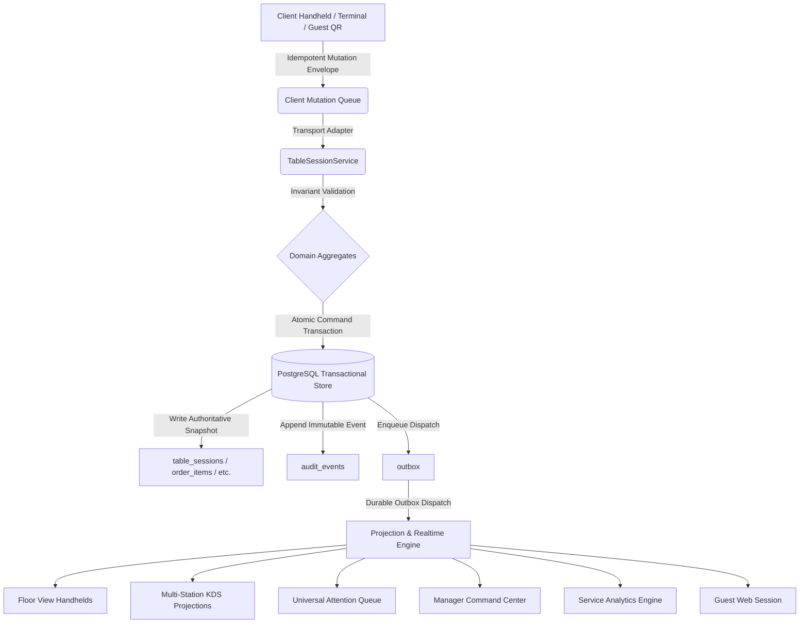

# Platform Architecture & Technical Reference

## 1. System Overview

The **Restaurant Operating System** is an authoritative transactional, projection-driven hospitality platform designed around a single core principle:

> **One live TableSession aggregate. Purpose-built projections for every stakeholder.**

Unlike legacy POS software built as siloed cashier terminals with bolt-on KDS screens, the platform treats the dining table as a real-time collaborative state machine. State mutations are committed transactionally with append-only audit events and a durable outbox for multi-device projection dispatch.

---

## 2. Core Domain Invariants & Rules

1. **Exact Integer-Cent Arithmetic**:
   - Floating-point arithmetic for currency is strictly prohibited.
   - All subtotals, modifier charges, half-topping splits, discounts, taxes, and tips are computed as non-negative integer cents.
   - Shared item divisions calculate deterministic integer quotients and assign remainder cents to the primary diner or designated party.
2. **Zero Duplicate Kitchen Firing Invariant**:
   - Every mutation envelope carries an `idempotencyKey`.
   - Re-delivered or retried course fires, item additions, and payments return cached snapshots without re-executing actions or printing/firing duplicate tickets.
3. **Continuous Pre-Split Reconciliation**:
   - Diner item ownership is tracked at entry (`single`, `shared_diners`, `whole_table`).
   - Checks are continuously pre-split in real time; servers never reconstruct bill splits at table turn time.
4. **Invalid-State Prevention**:
   - Semantic modifiers are strictly validated prior to kitchen dispatch (mutually exclusive options, required selections, portion placement, size constraints, allergen acknowledgments, and 86'd out-of-stock items).
5. **Universal Attention Routing**:
   - Service requests are role-routed deterministically (Runners, Bartenders, Servers, Managers) and track age and escalation thresholds ($2\text{m}, 4\text{m}, 8\text{m}$).

---

## 3. Platform Core vs. Tenant Configuration

The platform architecture enforces strict separation between the domain engine and restaurant tenant configurations:

| Component | Responsibility |
| :--- | :--- |
| **Platform Core (`lib/domain/`)** | Universal domain aggregates (`TableSession`, `OrderItem`, `KitchenTicket`, `GuestRequest`, `Check`, `Payment`), attention rules engine, modifier validation, offline queue, and event taxonomy. Zero cuisine dependencies. |
| **Tenant Configuration (`lib/domain/models/tenant.ts`)** | Declarative metadata per restaurant brand: branding/logos, kitchen station topologies, menu categories, modifier groups, dining room table layouts, employee PINs, and service policies. |
| **Demo Tenants** | `SIC_PIZZA_TENANT` (Artisan Wood-Fired Pizzeria) and `SAKURA_IZAKAYA_TENANT` (Robata Yakitori & Sushi Bar). |

---

## 4. Multi-Station Kitchen Display System (KDS) & Expo

An order is not a flat paper ticket. It projects into station-specific queues:
- Stations: `PIZZA`, `GRILL`, `FRY`, `SALAD`, `BAR`, `DESSERT`, and `EXPO`.
- Stations receive only relevant items and modifiers with placement context (`[Left 1/2]`, `[Right 1/2]`, `NO`, `EXTRA`, `SIDE`).
- The **Expo Master View** synthesizes all station tickets for a table, indicating multi-station completion status before food runner dispatch.

---

## 5. Offline Resiliency & Synchronization

- **Client Mutation Queue**: 4-state lifecycle (`PENDING` $\to$ `SYNCING` $\to$ `SYNCED` / `RETRYING` $\to$ `FAILED`).
- **Offline Boundaries**:
  - Permitted offline: Item entry, course firing, guest requests, section transfers.
  - Prohibited offline: Live gateway payment capture, session closure.
- **Transport Abstraction**: Generic `TransportAdapter` interface decoupling domain logic from specific WebSocket/SSE/Server Action transports.

---

## 6. Staff Authentication Boundary

- Staff identities and salted scrypt PIN hashes are stored in PostgreSQL; application code contains no staff directory or plaintext demo PINs.
- Successful PIN entry enrolls or reuses a location-scoped device record and creates an opaque, revocable eight-hour session. Only SHA-256 token digests are stored.
- Browsers receive session and device credentials as `HttpOnly`, `SameSite=Strict` cookies. Staff credentials are not returned in JSON, placed in URLs, or written to browser storage.
- Every staff route resolves the employee, location, organization, active device, expiration, and revocation state server-side before checking role permissions.
- Failed PIN attempts are recorded and limited to five per device fingerprint and location in fifteen minutes. Logout revokes the server record before clearing the cookie.
- Schema migration and synthetic credential enrollment must be completed in staging before this boundary can be released. Production PINs or employee exports must never be committed or seeded from demo data.
