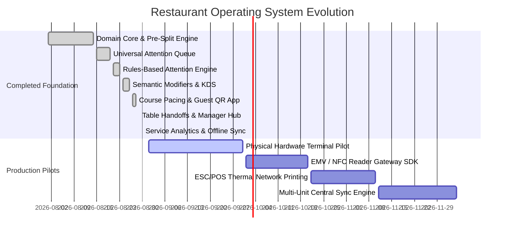

# Restaurant Operating System — Product Roadmap

## Milestone Overview

---

## 1. Current Foundation Capabilities (Milestones 1–15 Complete)

- **Domain Model**: `TableSession` aggregate with integer-cent math throughout.
- **Continuous Split Reconciliation**: Real-time diner-level subtotal, tax, and tip allocation.
- **Universal Request Queue**: Role-routed guest/staff requests (`Runner`, `Server`, `Bartender`, `Manager`).
- **Attention Engine ("Do This Next")**: Deterministic operational recommendations without LLM overhead.
- **Semantic Modifiers**: Invalid-state prevention, portion placement (`[Left 1/2]`), and allergen controls.
- **Multi-Station KDS & Expo**: Multi-screen order projection with synchronized readiness indicators.
- **Course Pacing**: Hold, fire now, and automatic pacing recommendations.
- **Guest QR Mobile Experience**: Rotating QR tokens, zero-install mobile web ordering, proposal approval gates.
- **Instant Table Handoffs**: State-derived shift transfers eliminating verbal brain dumps.
- **Manager Command Center**: Live service health monitoring answering *"What is going wrong right now?"*
- **Service Analytics**: Event-derived telemetry answering greet times, cook speeds, runner lag, and turn times.
- **Offline Mutation Foundation**: Zero duplicate firing invariant with exponential backoff client queue.
- **Multi-Tenant Separation**: Clean platform core tested with `SIC_PIZZA_TENANT` and `SAKURA_IZAKAYA_TENANT`.

---

## 2. Top 10 Next Improvements (Ranked by Pilot Impact)

| Priority | Feature / Workstream | Operational Impact | Complexity |
| :---: | :--- | :--- | :---: |
| **1** | **Physical ESC/POS Thermal Printing** | Direct Ethernet/Bluetooth printer driver for bar receipts and kitchen backup tickets. | Medium |
| **2** | **Physical Card Reader / EMV SDK** | Direct integration with Stripe Terminal / Adyen / Square for physical chip/tap payments. | High |
| **3** | **Realtime WebSocket / SSE Transport** | Live multi-device push updates replacing client polling. | Medium |
| **4** | **Automated Table Stage Sensor / RFID** | Proximity detection or cameras for auto-detecting bussed/cleared tables. | High |
| **5** | **Multi-Unit Cloud Sync & HQ Menu Push** | Central organization menu and modifier distribution across locations. | High |
| **6** | **Kitchen Prep Time Learning Models** | Dynamic ticket prep estimates based on current station queue depth. | Medium |
| **7** | **Inventory Ingredient Deduction** | Real-time 86'ing triggered automatically by recipe depletion counts. | High |
| **8** | **Guest Loyalty & SMS Digital Receipts** | 1-tap SMS receipt dispatch with zero account signup friction. | Low |
| **9** | **Tip Pool & Shift Settlement Reports** | Server checkout reports with hours, credit card tips, and runner pool splits. | Medium |
| **10** | **Floor Plan Visual Drag-and-Drop Editor** | Visual canvas for managers to dynamically rearrange table coordinates. | Low |

---

## 3. Pilot Readiness Assessment

### Is the system ready for a live pilot?
**The core domain and operational software foundation is 100% pilot-ready.**

### What remains before live restaurant deployment?
1. **Physical Card Terminal Driver**: Connect an EMV/NFC card reader (e.g. Stripe Terminal WisePOS E or BBPOS WisePad).
2. **Thermal Receipt Printer Link**: Connect network ESC/POS thermal printers for kitchen chits/bar drops.
3. **Hosted WebSocket Server**: Deploy WebSocket backend instance for multi-device sync across kitchen tablets and server handhelds.
