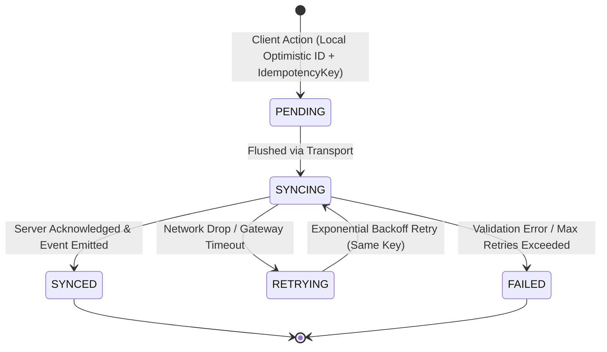

# Offline & Idempotent Mutation Foundation Architecture

## 1. Executive Summary

Restaurant floors operate in harsh RF environments: dense physical obstacles, commercial microwave interference, dynamic kitchen line movements, and fluctuating Wi-Fi access point handoffs. 

In conventional POS systems, network drops during ordering or payment result in either duplicate orders (accidental re-firing), double-billing, or frozen terminals.

This foundation establishes **Zero-Duplicate Mutation Semantics** and **Optimistic Client Synchronization** across all dining, coursing, request, and payment workflows.

---

## 2. Core Invariant

> **"A network retry must never accidentally fire the same kitchen item twice, create duplicate service requests, or double-charge a diner."**

---

## 3. The Mutation Lifecycle

Every state-changing client command transitions through four deterministic states:

1. **`PENDING`**:
   - The client generates a collision-resistant UUID `idempotencyKey` and applies the change optimistically to local UI state.
2. **`SYNCING`**:
   - Enqueued payload is transmitted over the active transport (`TransportAdapter`).
3. **`SYNCED`**:
   - The server validates, applies domain business logic, stores the result in `session.executedIdempotencyKeys[idempotencyKey]`, increments `session.version`, and appends immutable audit events.
4. **`RETRYING`**:
   - If a network error, HTTP 504, or transport disconnect occurs, the client mutation queue retains the identical `idempotencyKey` and schedules an exponential backoff retry ($1\text{s}, 2\text{s}, 4\text{s}, 8\text{s}\dots$).
5. **`FAILED`**:
   - Permanent validation or business rule rejection (e.g. attempting to order an 86'd item or voiding without reason).

---

## 4. Server-Side Deduplication Model

- Every `TableSession` aggregate maintains an `executedIdempotencyKeys: Record<string, any>` dictionary and an integer `version`.
- When an operation arrives with an `idempotencyKey`:
  1. If `key` exists in `executedIdempotencyKeys`, the service **immediately returns the cached result and snapshot** without creating new items, kitchen tickets, or payment records.
  2. If `key` does not exist, the mutation executes, the output is saved to `executedIdempotencyKeys[key]`, `version` is incremented, and the state is persisted.

---

## 5. Conflict Resolution Strategy

- **Optimistic Concurrency Control**:
  - Each mutation payload includes the `baseSessionVersion`.
  - If remote state has advanced concurrently (e.g. another server transferred the table or closed the session), the server rejects conflicting writes while preserving non-conflicting commutative actions (e.g., adding an item to a different seat).

---

## 6. Offline Boundaries & Disconnected Prohibitions

To preserve fiscal integrity and security, specific operations are partitioned across connectivity boundaries:

| Operation | Permitted While Disconnected? | Rationale & Safety Boundary |
| :--- | :---: | :--- |
| **Draft / Add Items** | **YES** (Queued) | Safely queues locally with UUIDs; syncs upon reconnect. |
| **Course Firing** | **YES** (Queued) | Deduplicated via idempotency key; will never duplicate line tickets. |
| **Guest Requests** | **YES** (Queued) | Attention queue deduplicates requests by ID. |
| **Table Handoffs** | **YES** (Queued) | Optimistically updates local server section. |
| **Live Payment Capture** | **PROHIBITED** | Online gateway authorization required to prevent uncollectible chargebacks (unless offline payment store-and-forward gateway mode is enabled). |
| **Session Closure / Settle** | **PROHIBITED** | Requires verified 0 balance confirmation from central server. |

---

## 7. Transport-Agnostic Abstraction

The `TransportAdapter` interface decouples domain logic from specific networking protocols:
- Local Mock Transport (Unit testing)
- WebSockets / HTTP Server Actions (Next.js production runtime)
- Server-Sent Events (SSE) / Cloud PubSub backends
